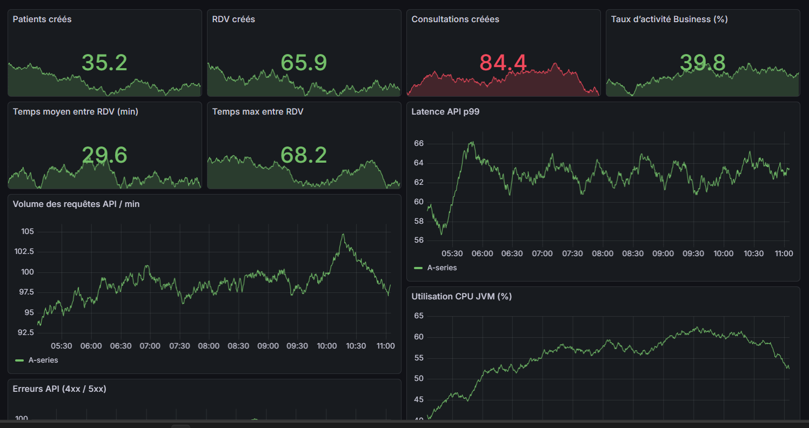
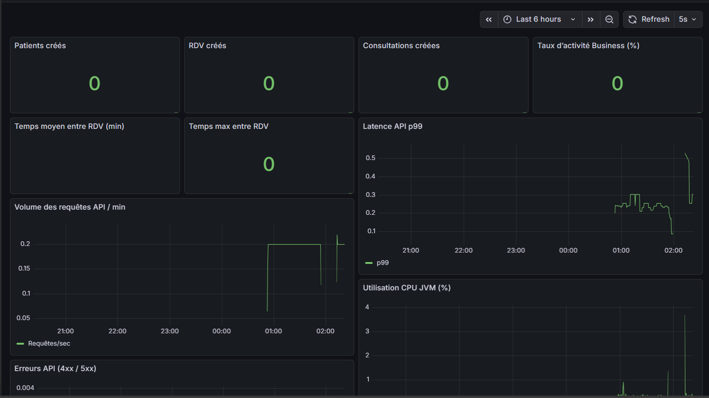

# 📊 BACKEND-MONITORING-SOINS-SANTE  
### Système de monitoring du backend – Application Soins Santé

🎓 **Projet académique – Cycle Ingénieur (Cloud & Systèmes Distribués)**  
🔧 **Orientation : DevOps – Observabilité – Backend Spring Boot**

---

## 🧭 Vue d’ensemble

**BACKEND-MONITORING-SOINS-SANTE** est un projet dédié à la **mise en place d’un système de monitoring**
pour la partie **backend Spring Boot** d’une application de gestion des soins de santé.

L’objectif est d’assurer :
- la **surveillance en temps réel** des performances,
- la **détection proactive des incidents**,
- la **visualisation claire des métriques techniques**,
- et la **préparation à un environnement de production**.

---




## 🎯 Objectifs du projet

- Mettre en place un système de monitoring backend fiable
- Exposer les métriques applicatives avec Spring Boot Actuator
- Collecter les métriques via Prometheus
- Visualiser les données avec Grafana
- Analyser les performances et la stabilité du backend
- Préparer l’application à une exploitation en production

---

## 🏗 Architecture du monitoring

Le système de monitoring repose sur l’architecture suivante :

```md

